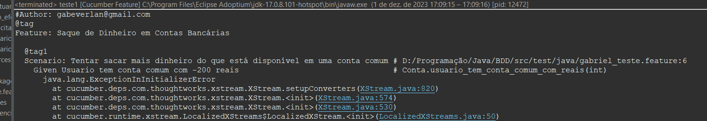
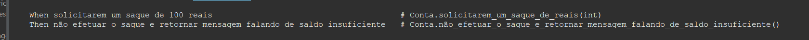
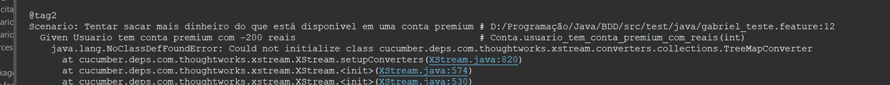
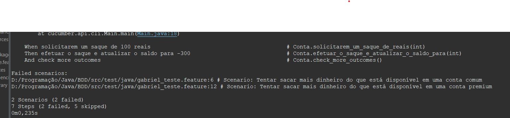

# BDD_Cucumber - Exercício de Desenvolvimento
Um exercício de desenvolvimento BDD para a criação de um sistema de conta bancária utilizando o Cucumber.

# Cenario de teste
```cucumber
#Author: gabeverlan@gmail.com

@tag
Feature: Saque de Dinheiro em Contas Bancárias
  @tag1
  Scenario: Tentar sacar mais dinheiro do que está disponível em uma conta comum
    Given Usuario tem conta comum com -200 reais
    When solicitarem um saque de 100 reais
    Then não efetuar o saque e retornar mensagem falando de saldo insuficiente
    
  @tag2
  Scenario: Tentar sacar mais dinheiro do que está disponível em uma conta premium
    Given Usuario tem conta premium com -200 reais
    When solicitarem um saque de 100 reais
    Then efetuar o saque e atualizar o saldo para -300
    And check more outcomes
```
## Implementação Inicial
Após a execução do cenário de teste pela primeira vez, foram sugeridos os seguintes métodos a serem implementados.

```java
@Given("^Usuario tem conta comum com -(\\d+) reais$")
public void usuario_tem_conta_comum_com_reais(int arg1) throws Throwable {
    // Write code here that turns the phrase above into concrete actions
    throw new PendingException();
}

@When("^solicitarem um saque de (\\d+) reais$")
public void solicitarem_um_saque_de_reais(int arg1) throws Throwable {
    // Write code here that turns the phrase above into concrete actions
    throw new PendingException();
}

@Then("^não efetuar o saque e retornar mensagem falando de saldo insuficiente$")
public void não_efetuar_o_saque_e_retornar_mensagem_falando_de_saldo_insuficiente() throws Throwable {
    // Write code here that turns the phrase above into concrete actions
    throw new PendingException();
}

@Given("^Usuario tem conta premium com -(\\d+) reais$")
public void usuario_tem_conta_premium_com_reais(int arg1) throws Throwable {
    // Write code here that turns the phrase above into concrete actions
    throw new PendingException();
}

@Then("^efetuar o saque e atualizar o saldo para -(\\d+)$")
public void efetuar_o_saque_e_atualizar_o_saldo_para(int arg1) throws Throwable {
    // Write code here that turns the phrase above into concrete actions
    throw new PendingException();
}

@Then("^check more outcomes$")
public void check_more_outcomes() throws Throwable {
    // Write code here that turns the phrase above into concrete actions
    throw new PendingException();
```

# Print de console atual após modificação

## Tag 1 - Scenario 1 - Tentar sacar mais dinheiro do que está disponível em uma conta comum
Prints após implementação da primeira sujestão:



## Tag 2 - Scenario 2 - Tentar sacar mais dinheiro do que está disponível em uma conta premium
Prints após implementação da primeira sujestão:


